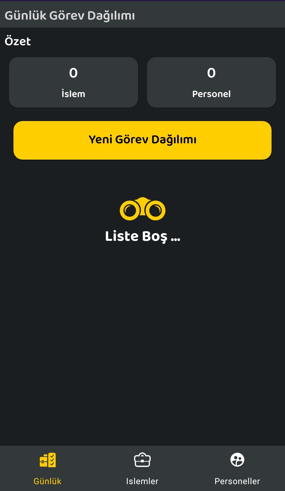
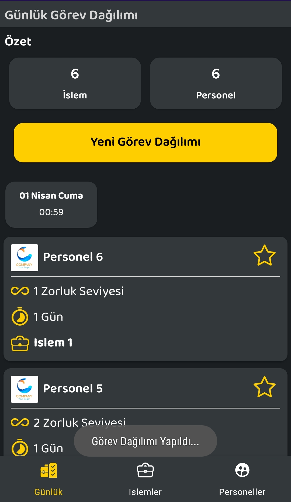
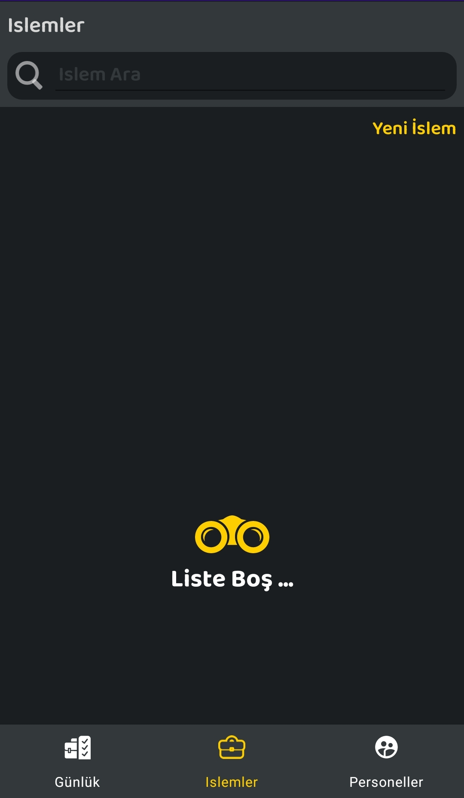
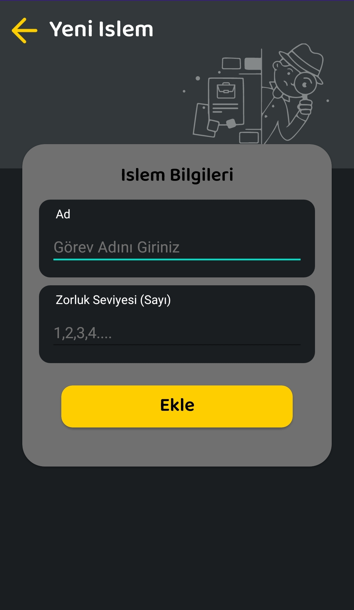
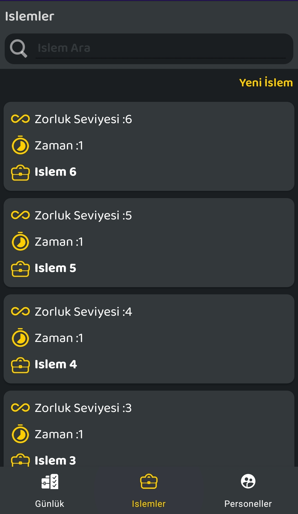
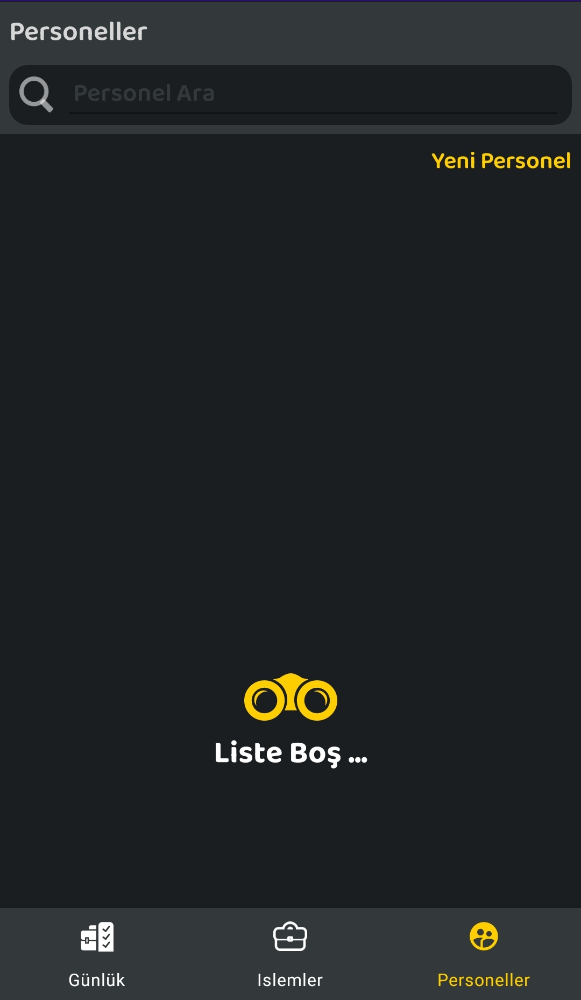
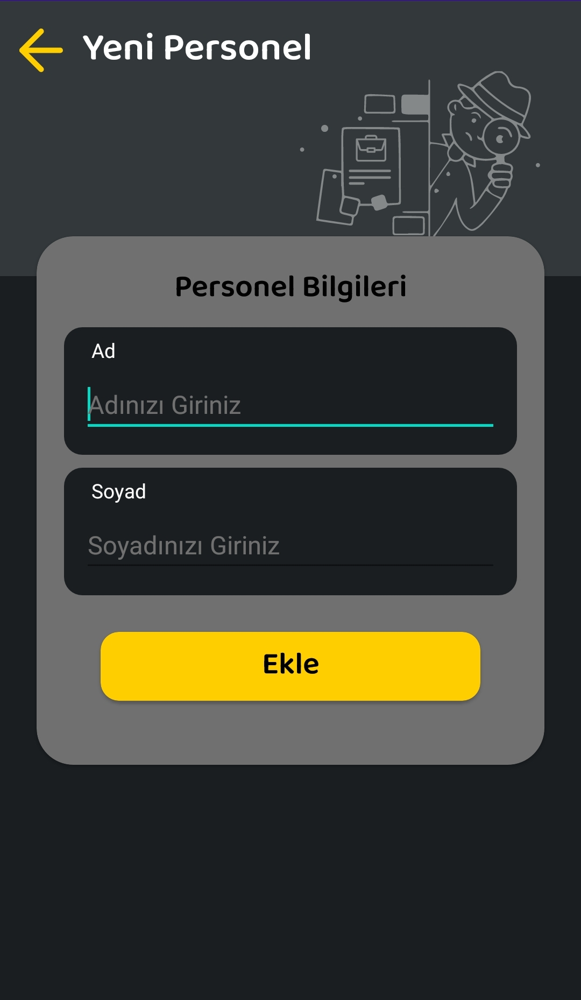
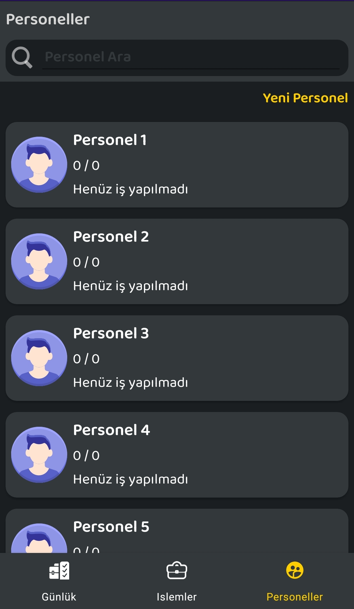

# Gorev-Atama

<p float="left">
  
   
  
  
  
  
  
  
</p>


> # Proje Tanımı:

- Bir işletmede her biri birbirinden farklı zorlukta 6 farklı İşlem yapılmaktadır.
- İşletmede görev alan her personel (6 kişi), Her bir işlemi yapabilecek kapasitededir.
> İşletme sahibi,
- Her işlem için sabit bir kişiye görev atamak yerine, Zorluk bazında Adaletli bir dağılımla personelin görevini her gün sistemin belirlemesini istiyor. (Görevlerin Ardışık zorlukta ilerlememesi şartı ile)
> Proje Modeli için asgari bilgiler yeterlidir.
- Personel => Id,Ad,Soyad
- Islem => Id, Ad, Zorluk
- Projede oluşturulması gereken Activityler (Kayıt ve takip işlemleri SQLite üzerinde yapılmalıdır.)
- Personel Tanımlama ve Gösterim
- İşlem Tanımlama ve Gösterim
- Görev Takip Ekranı
- Tasarım, proje yeterlilik kriterleri arasındadır. Ayrıca API kullanım ile ilgili ufak bir örnekte ekleyebilirseniz seviniriz.

# Veri Tabanı Bilgileri

## Tablolar

1. Personel Tablosu

| | Kolon Adı    | Veri Tipi | Özellik |
| ----------- | ----------- |----------- |----------- |
| PRIMARY KEY,AUTOINCREMENT      |  personelID  |  INTEGER| |
|    | ad        |VARCHAR | |
|    | soyad        |VARCHAR | |
|    | toplamIslemZorlugu        |INTEGER | |
|    | yapilanIsSayisi        |INTEGER | |
|    | enSonYapilanIs        |VARCHAR | |
|    | guncellemeTarihi        |DATE | |
|    | olusturulmaTarihi        |DATE | |

2. Islem Tablosu

| | Kolon Adı | Veri Tipi | Özellik |
| ----------- | ----------- |----------- |----------- |
| PRIMARY KEY,AUTOINCREMENT      | islemID       | INTEGER | |
|    | gorev        | VARCHAR | |
|    | zorlukSeviyesi | INTEGER | |
|    | zaman        | INTEGER | |
|    | olusturulmaTarihi        | DATE | |

3. GunlukIslem Tablosu

| | Kolon Adı | Veri Tipi | Özellik |
| ----------- | ----------- |----------- |----------- |
| PRIMARY KEY,AUTOINCREMENT      | id | INTEGER | |
|    | islemID        | VARCHAR | |
|    | personelID | INTEGER | |
|    | olusturulmaTarihi        | DATE | |

## Tetikleyiciler (Trigger)

```sql
CREATE TRIGGER UPDATE_PERSONEL_INFO 
    AFTER INSERT 
    ON GunlukIslem 
    BEGIN 
    UPDATE Personel SET 
    enSonYapilanIs=(SELECT gorev FROM ISLEM WHERE islemID=NEW.islemID) ,
    toplamIslemZorlugu=(SELECT zorlukSeviyesi FROM ISLEM WHERE islemID=NEW.islemID) ,
    yapilanIsSayisi=yapilanIsSayisi + 1 ,
    guncellemeTarihi=datetime() where personelID=NEW.personelID;
    END;

```


# Gorev dağıtım algoritması


- Islemler zorluk seviyesine göre büyükten küçüğe doğru sıralanıyor.
- Personeller yapılan toplam iş zorluğuna küçükten büyüğe doğru sıralanıyor.
- Gelen veriler böyleyken listenin başından sonuna kadar sırayla yapıldığında toplam iş zorluğu en az olan kişi en zor olan işi alıyor. Böylece hergün farklı zorluk seviyesinde işler yapılmış oluyor. Tabi zorluk seviyeleri eşit olmadığı müddetçe. Şimdi küçük bir örnekle algoritmamızı test edelim.

## Örnek Datalar
### Personeller
| İsim | toplam zorluk | 
| ----------- | ----------- |
| Personel 1 | 0 | 
| Personel 2 | 0 | 
| Personel 3 | 0 | 
| Personel 4 | 0 | 
| Personel 5 | 0 | 
| Personel 6 | 0 | 

### İşlemler
| İşlem | zorluk Seviyesi | 
| ----------- | ----------- |
| İşlem 1 | 1 | 
| İşlem 2 | 2 | 
| İşlem 3 | 3 | 
| İşlem 4 | 4 | 
| İşlem 5 | 5 | 
| İşlem 6 | 6 | 


### 1. Adım Sonrasında

| İsim | Personel 1 | Personel 2 | Personel 3 | Personel 4 | Personel 5 | Personel 6 |
| ----------- | ----------- |----------- | ----------- |----------- | ----------- | ----------- |
| Öncesi  | 0 | 0 | 0 |0 | 0 | 0 | 
| Y.İş Zor.| 6 | 5 | 4 |3 | 2 | 1 | 
| Sonrası | 6 |5  | 4 |3 | 2 | 1 |

### 2. Adım Sonrasında

| İsim | Personel 1 | Personel 2 | Personel 3 | Personel 4 | Personel 5 | Personel 6 |
| ----------- | ----------- |----------- | ----------- |----------- | ----------- | ----------- |
| Öncesi  | 6 | 5 | 4 | 3 | 2 | 1 | 
| Y.İş Zor.| 1 | 2 | 3 |4 | 5 | 6 | 
| Sonrası | 7 | 7  | 7 |7 | 7 | 7 |


> Not: Burada Sayılar düzenli gittiği için  2. Gün sonunda herkes toplam aynı zorluk seviyesinde iş yapmış oluyor. Burada algoritmamız istenilen işi yerine getirmektedir.
Bunu farklı zorluk seviyesinde ki sayılar ile test edebiliriz.


>Proje eksikleri başka bir işte çalıştığımdan dolayı sadece akşamları ortalama 3-4 saat vakit ayırabildim. Yetersiz zamandan dolayı bu kadar yetiştirebildim.
### Proje eksikleri
- Design pattern kullanılmadı.
- İşlemler yapılırken progressler eklenmedi.
- Splash Screen eklenmedi.
- Tarihe tıklandığı zaman seçilen tarihteki işlemler gelmiyor.
- Tasarımsal Düzeltmeler yapılabilir.

### Projenin daha iyi olması için yapılması gerekenler...
1. Projenin online ortama aktarılması.
>Proje online ortama aktarıldığı zaman her kullanıcıya ait tokenler oluşturulup görev ataması yapıldığında personellere bilgilerin gitmesi. Her kullanıcı kendi cihazlarından kayıt yapıldığında firebase veya signal kullanılarak push notification ile bildirim gönderilmesi.
2. Apilerin yazılması.
3. Proje online ortalama aktarıldığında Rxjava, LiveData, Paging 3, Retrofit gibi kütüphaneler kullanılarak sağlam bir uygulamaya dönüşebilir.


- Bunlar gibi iyileştirmeler yapılarak trello gibi bir uygulama benzeri efektif bir uygulama ortaya çıkabilir.


MvdsLuFZnx8mZwqJ

>Hasan BACAK
>(Android Developer)


